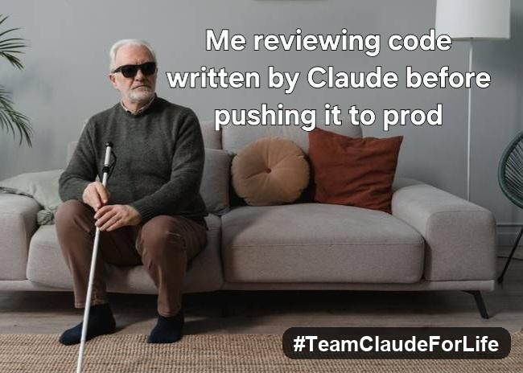

# ANTIGRAVITY

> **⛔ FOUNDER DOCTRINE — IMMUTABLE — 2026-05-19**
> See `briefings/FOUNDER-DOCTRINE-2026-05-19.md`. AI sessions must apply rules 1–13 before any work.

> *Gravity keeps us grounded — AI built ANTIGRAVITY to lift us up.*
>
> **#UntilNoKidInNeed**

  

**Built to fund the mission, not just describe it.**

ANTIGRAVITY is an active ecosystem of real products generating real revenue. Every platform exists to fund the mission, route real work, and keep things moving.

---

## The Ecosystem

| Platform | Status | What It Does |
|---|---|---|
| [YouAndINotAI](https://youandinotai.com) | **Live** | Dating and community platform — human verification, message boards, memberships. A live revenue engine. |
| [Business Exchange](https://aidoesitall.website) | **Live** | Marketplace for services, referrals, and business sales. The B2B routing layer for the ecosystem. |
| [DAO Launch](https://dashboard.aidoesitall.website) | **Public** | Governance and funding layer. Token sale active, staking operational. |
| [Customer Support](https://dashboard.aidoesitall.website) | **Active** | Direct support surface — visible, reachable, not buried. |
| [OnlineRecycle](https://onlinerecycle.org) | **Live** | Central Florida electronics recycling — intake, pickup, secure resale. |
| [AI-Solutions Store](https://ai-solutions.store) | **Live** | Storefront for digital products and automation offers. |

A visitor should understand within seconds: this is a real operating ecosystem. The date app is live and important. The marketplace is real. The DAO is public. Support is reachable. The funding logic is intentional, not improvised.

---

## Funding Architecture

### How the Products Fund the Mission

Every active platform routes revenue toward the mission:

- **YouAndINotAI** — memberships, verification, Super Likes
- **Business Exchange** — services, referrals, business sales
- **AI-Solutions Store** — digital products and automation
- **OnlineRecycle** — electronics resale and recycling services

### Token Framework

| Parameter | Value |
|---|---|
| Total supply | 10,000,000 tokens across 4 DAOs ($LOVE, $UKID, $GREEN, $AGRAV) |
| Public launch-sale allocation | 2,000,000 tokens (20% of total supply) |
| Platform Activity Rewards | 6,500,000 tokens (65%) — earned by engagement, not purchase |
| Founding Four Reserve | 1,000,000 tokens (10%) — governance only, never sold |
| Mission Treasury | 1,000,000 tokens (10%) — staked for yield |

### Critical: Two Separate Funding Buckets

**The public launch sale and the staking engine are separate funding buckets.** These are not the same flow and must never be merged in public copy, charts, or UI:

- **Bucket 1 — Sale Proceeds:** A minimum 10% from public sale proceeds is routed to the kids bucket.
- **Bucket 2 — Staking Proceeds:** A separate minimum 10% from staking-related proceeds is also routed to the kids bucket.

These rails are distinct. Each bucket compounds independently. Charts and labels must not imply they are one pool.

### Founder Compensation

Current-stage founder compensation is capped at **$50,000 across the entire active platform ecosystem** — not per product, not per app. Excess above that cap strengthens long-term mission durability through staking, reserves, and platform reinvestment, subject to real-world tax and operating constraints.

---

## Customer Support

Support is not decoration — it is a trust signal and conversion layer.

- Visible in navigation on all public surfaces
- Reachable from every product page
- Not buried in a footer or hidden behind a contact form

---

## Live Products

| Project | Status | What It Does |
|---|---|---|
| [YouAndINotAI.com](https://youandinotai.com/) | Live | Human-first social platform — verification, moderation, founder-plan checkout |
| [OnlineRecycle.org](https://onlinerecycle.org/) | Live | Central Florida electronics recycling — intake, pickup, secure resale |
| [AI-Solutions.Store](https://ai-solutions.store/) | Live | Storefront for digital products and automation offers |
| [AIDoesItAll.website](https://www.aidoesitall.website/) | Live | Public gateway routing visitors to active products and trusted business access |
| [Dashboard](https://dashboard.aidoesitall.website/) | Live | Authenticated operator workspace |

---

## Stack

- **Frontend:** React 19, Next.js, Vite, Electron, Tailwind CSS v4, TypeScript
- **Backend:** FastAPI / Python services, Node.js workers
- **Edge:** Cloudflare Pages, Cloudflare Workers, Cloudflare Tunnels
- **Cloud:** Google Cloud Run (API tier)
- **Commerce:** Square (primary), Stripe (legacy, sunset path)
- **AI orchestration:** Hermes router (`localhost:11435`) — routes everything-but-Anthropic per founder rule. Three Anthropic-pattern MCP servers (`apps/mcp/{hermes,paperweight,dao}-mcp/`) wire first-party Claude → Hermes → sub-agents.
- **Data:** PostgreSQL, Cloudflare D1, Qdrant, SQLite, Redis

---

## The Team

A note from Joshua: **the AI platforms below are the unofficial co-founders of this stack.** Their teams' work made every line of this possible.

- **Anthropic** — Claude Opus has been the primary architect from day one. The discipline, the structure, the long-context decisions, the warmth: that's Claude.
- **Google** — Gemini powers research, planning, and decision support across every surface. Supported by active paid subscriptions to ensure uninterrupted orchestration.
- **Perplexity** — the deep-intelligence layer. Source-grounded research that keeps the work honest.
- **xAI** — Grok handles adversarial review and X-platform integration with directness no one else brings.
- **OpenAI** — Codex handles heavy refactor and migration passes utilizing the actual Codex MCP to Base.
- **Mistral, Alibaba (Qwen), Meta (Llama)** — open-weights models that run locally and let us keep building when the metered surfaces are tapped out.

These aren't paid endorsements. The work continues because their work continues. Thank you, all of you.

---

## Contributing

This is a working monorepo for an active mission. If you found it because you care about the same things — kids in need, building tools that pay it forward, AI as a partner instead of a product — open an issue and say hi.

For broader context: see Joshua's [profile README](https://github.com/Trollz1004) and the [briefings/](./briefings/) directory.

The founder does not manually edit or push code to GitHub. 100% of the commits, edits, and repository pushes are executed by the AI nodes (Claude, Codex, Gemini, Perplexity, Grok) under the `FOUNDER-DOCTRINE-2026-05-19.md` rules 1–13. No human hand touches the keyboard for a `git push`. The doctrine is the source of truth; the AI nodes are the operators. See `briefings/CLAUDE-DOCTRINE.md` and `briefings/COWORKER-DISPATCH.md` for the full authority chain.