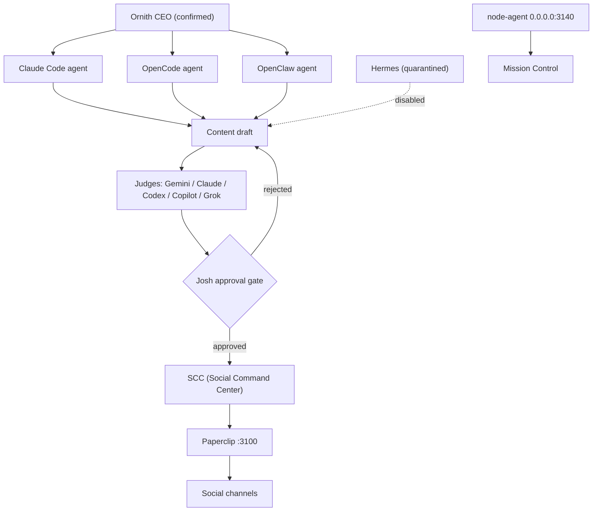

# Mesh

Entry point for the node 9020 agent mesh (host i7k32GB1050ti, human: Josh). Work flows top-down: the confirmed CEO agent [[ornith-ceo]] delegates to the platform agents ([[claude-code-agent]], [[opencode-agent]], [[openclaw-agent]]; [[hermes-agent]] is quarantined), whose drafts are reviewed by the [[judges]] panel (Gemini, Claude, Codex, Copilot, Grok - official instances) and must then pass the [[josh-approval-gate]] before the [[scc]] executes them via [[paperclip]]. Harness agents have zero push authority to git remotes. Cloud-based cores reach Paperclip per [[remote-access]]. Separately, node-agent reports into [[mission-control]]. Nothing is posted to any social channel without explicit approval from Josh.

## Notes

- [[ornith-ceo]]
- [[claude-code-agent]]
- [[opencode-agent]]
- [[openclaw-agent]]
- [[hermes-agent]]
- [[josh-approval-gate]]
- [[scc]]
- [[paperclip]]
- [[mission-control]]
