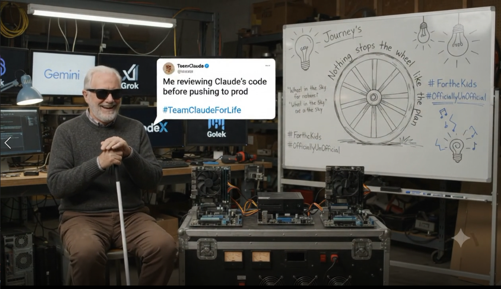

# AntiGravity · Autopilot Cockpit (local admin console)

   
  <i>Nothing stops the wheel like the plan.</i> #TeamClaudeForLife · #OfficiallyUnOfficial Unofficial fan tribute. Not affiliated with or endorsed by Anthropic, Google, xAI or OpenAI.

`index.html` is a local-only operator console for the two-node LAN fleet
(Alienware `192.168.0.40` = DEV node, Sabretooth `192.168.0.8` = FINISHED-PRODUCT
node). It polls each node's real endpoints every 5 seconds and shows real or
zero — no fake greens, no invented counts.

## How to open it

JARVIS serves this folder at `http://192.168.0.8:9150/cockpit/` (same origin
as `/api/nodes`, which is the only thing the page reads; it never probes a
port itself). Open it there. Opening `index.html` as a `file://` page still
renders, but a browser will not load `cockpit.local.json` from disk, so the
CRD buttons stay generic in that mode and say so.

## Local-only rule

This tool is never deployed publicly and is never copied into `domains/` or
any other public deploy path. A CI grep guard (`cockpit-local-only`) fails the
build if the string "Autopilot Cockpit" appears anywhere under `domains/`.
Do not link this page from any public page.

## CRD session links

`cockpit.local.json` (gitignored) holds the two Chrome Remote Desktop session
URLs; copy `cockpit.local.example.json` and fill it in on the node. Only
`https://remotedesktop.google.com/` URLs are accepted.
