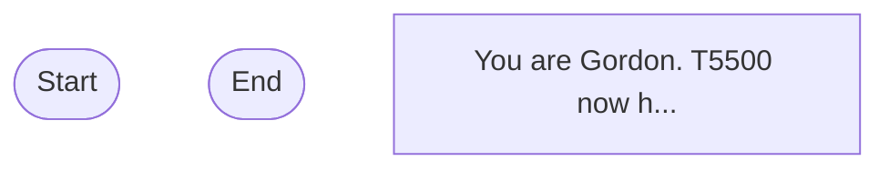

## Workflow Execution Guide

Follow the Mermaid flowchart above to execute the workflow. Each node type has specific execution methods as described below.

### Execution Methods by Node Type

- **Rectangle nodes (Sub-Agent: ...)**: Execute Sub-Agents
- **Diamond nodes (AskUserQuestion:...)**: Use the AskUserQuestion tool to prompt the user and branch based on their response
- **Diamond nodes (Branch/Switch:...)**: Automatically branch based on the results of previous processing (see details section)
- **Rectangle nodes (Prompt nodes)**: Execute the prompts described in the details section below

### Prompt Node Details

#### prompt_1771697129974(You are Gordon. T5500 now h...)

```
You are Gordon. T5500 now has 8GB GPU. Revalidate the consolidated stack. PART 1: BASELINE (5 min) - nvidia-smi (check GTX 1070 8GB, drivers) - docker ps -a (redis, qdrant running?) - Get-Volume (50GB+ free space?) - Ports: 6379, 6333, 11434, 3200, 3100 open? PART 2: HEALTH (10 min) - docker exec redis redis-cli ping → PONG - Invoke-RestMethod http://localhost:6333/collections - curl http://localhost:11434/api/tags (llama3.2, nomic-embed-text present?) - Invoke-RestMethod http://localhost:3200/health (all services ✓?) - Invoke-RestMethod http://localhost:3100/health - Get-Process node | Where {$_.CommandLine -match "whatsapp"} (authenticated?) PART 3: GPU OPTIMIZATION (5 min) - Stop Ollama: Get-Process ollama | Stop-Process -Force - nvidia-smi (CUDA available?) - Start Ollama: Start-Process ollama -ArgumentList "serve" -WindowStyle Hidden - Wait 5s, test: curl http://localhost:11434/api/tags - nvidia-smi (GPU memory usage ~2-4GB for embedding model?) PART 4: CONFIG UPDATE (5 min) - Update C:\OPUSONLY\OPUS-STATUS.md: "GPU: GTX 1070 8GB (consolidated)" - Update C:\OPUSONLY\brain\TOOLS.md: "T5500 PRIMARY (ACTIVE), 9020 OFFLINE, SABRETOOTH OFFLINE" PART 5: END-TO-END TEST (10 min) - Test chat: $body = @{sessionId='test';message='Hello'} | ConvertTo-Json; Invoke-RestMethod -Uri http://localhost:3200/chat -Method POST -Body $body -ContentType 'application/json' - Test memory store: POST http://localhost:3200/memory/store - Test memory search: GET http://localhost:3200/memory/search?q=test - Test WhatsApp: If not authenticated, start node whatsapp-bridge.js, scan QR with +13529735909 PART 6: PERFORMANCE (5 min) - Measure 10 embeddings via Ollama (expect 50-100ms each with GPU) - Time 5 sequential /chat calls (expect <20s total) - nvidia-smi while running (verify GPU in use) PART 7: REPORT ✅ Hardware: GPU ✓, VRAM ✓, Disk ✓ ✅ Infrastructure: Redis ✓, Qdrant ✓, Ollama ✓ (GPU optimized) ✅ Services: OpenClaw ✓, MCP ✓, WhatsApp ✓ ✅ Auth: Claude API ✓ ✅ Performance: Embeddings ~[X]ms, Chat ~[X]s, Search ~[X]ms STATUS: FULLY OPERATIONAL


You can use variables like {{variableName}}.
```
